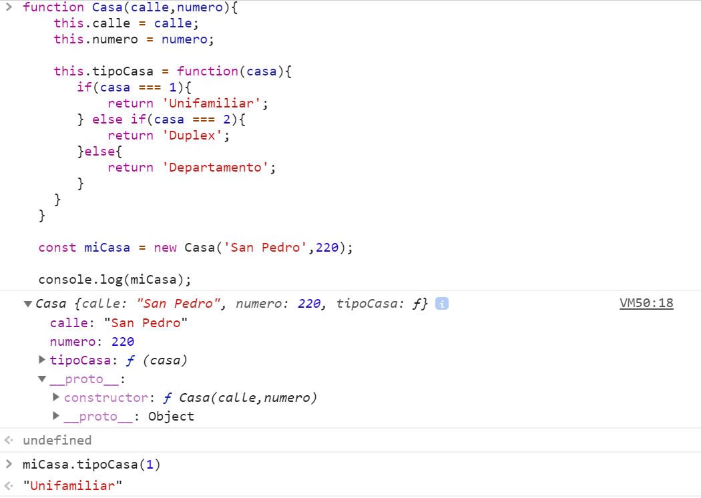
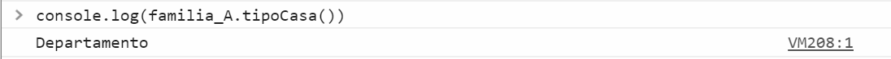

# Mi Manual de JavaScript 
#### by Dev-EUAB

# Condiciones IF,ELSE,ELSE IF y Operadores Lógicos/Relacionales
>## IF / ELSE
>Compara si ambas variables son iguales y nos arroja un mensaje en caso de que sea cierto, y en caso de que no (**else**) arroja un mensaje de que son diferentes.

>Un uso común de las **Condiciones** es para *Comparar* dos o mas variables.
>Para estos casos se utilizan **Los Operadores Relacionales**.
>
>Los cuales son:

|Operador|Nombre|Ejemplo|Descripcion|
|---|---|---|---| 
|< 	|menor que| 	a < b| 	a es menor que b|
|> 	|mayor que| 	a > b| 	a es mayor que b|
|== |	igual a| 	a == b| 	a es igual a b|
|!= |	no igual a |	a != b| 	a no es igual a b|
|<= |	menor que o igual a| 	a <= 5| 	a es menor que o igual a b|
|>= |	mayor que o igual a| 	a >= b| 	a es menor que o igual a b|

>Estos operadores se ponen en la estructura del las condicionales dependiendo de lo que necesitemos en nuestro caso **`==`** 

```js
const variableA = 1;
const variableB = 1;
```
### `==` Operador de igualdad
```js
if(variableA == variableB){
  console.log('Las variables son iguales')
}else{
console.log('Las variables son diferentes')
}
```

### `===` Operador de igualdad estricto

>¿Por que estricto?
>>Se le hace llamar así debido a que ese operador no solamente compara el valor de la variable si no también el tipo de variable y compara ambas cosas.

### Ejemplo

```js
const variable_Numero = 1;
const variable_Objeto_Numero = new Number(20) ;
```

```js
if(variable_Numero === variable_Objeto_Numero){
  console.log('Las variables son iguales')
}else{
 console.log('Las variables son diferentes')
}
```
>>>podemos observar que ambas variables tiene el valor de **20** pero la diferencia es que uno es un **Objeto de tipo Numero** y el otro es una **variable numero**, así que nunca serán iguales aunque tengan el mismo valor debido a que son dos tipos diferentes.  

Sabiendo lo anterior podemos utilizar tambien **Los Operadores Logicos**

>Operadores Logicos

```js
/*
|Operador|Nombre     |Descripcion           |
|   &&   | 'Y'       | "lo anterior Y esto" |   
|   ||   | 'Ó'       | "lo anterior Ó esto" |  
|    !   |'Negacion' | "niega lo siguiente" | 
*/
```


># Operador `&&` "Y" "AND"
>>>El operador AND menciona que ambos casos deben de ser verdaderos para seguir adelante.

># Operador `||` "O" "OR"
>>>El operador OR menciona que mientras haya un verdadero seguir adelante.

># Operador `!` "Negación" "NOT"
>>>El operador NOT tiene como función negar la declaración siguiente, si una evaluacion será TRUE este lo niega y lo volvera FALSE y de la misma manera a la inversa.

># NOTA
>>Un IF simpre su estructura evalua TRUE, que se quiere decir con eso que al momento de escribir `if(variable)` la `variable` se estara evaluando para que sea `true` y en caso de que no sea `true` entrara la fase de `else{}` el cual es cuando no se cumple el `true`.

### Ejemplo
```js
  const varA = 20; 
  const varB = 20; 

  const varD = 10; 
  const varE = 15; 
```
```js
  if( (varA === varB) && (varD === varE) ){ 
    console.log('Son iguales');
  }else{
    console.log('Son diferentes');
  }
  //El mensaje que se mostrara sera -Son diferente, esto es porque la primera parte se cumple varA y varB son iguales, así que pasa a la siguiente comparación la cual no se cumple  varD y varE no son igual sabiendo eso compara ambos resultados esperando 
```

># ELSE IF
>Es una condicional extra la cual surge despues e un `IF` siempre y cuando el `IF` sea de resulta `FALSE` se ejecuta la siguiente condicional sin pasar por "si no sucede, esto" , por mencionarlo de otra forma es algo como - "Si no, sucede lo anterior evalua lo siguiente".

### Ejemplo
```js
  const varA = 'Hola';
  const varB = 'Adios';

  const varC = 'Hola';
```

```js
if(varA == varB){
  console.log('Son iguales varA y varB');
}else if( varA == varC){
  console.log('Son iguales varA y varC');
}

//La variable sera evaluada hasta que encuentre un estado TRUE y ahi se detendra.
```
>NOTA
>Se pueden agregar tantos `ELSE IF` como sean necesario pero, siempre y cuando sea seguido de un `IF`.

```
# NOTA
Si tu intencion es evaluar una variable para retornar "algo" una buena practica es utilizar  SWTICH
```

># SWITCH
>Su función es evaluar una variable en diferentes escenarios ya que pueden poner las diferentes situaciones en las cuales puede ser verdadera y retornar o hacer alguna función especifica.


### Ejemplo
```js
  const calificacion = 6;
```

```js
  switch(varA){
    case 5: 
      console.log("El Alumno no excento la materia");
      break;
    case 6: 
      console.log("El Alumno excento la materia");
      break;
    case 7: 
      console.log("El Alumno excento la materia");
      break;
    case 8: 
      console.log("El Alumno excento la materia");
      break;
    case 9: 
      console.log("El Alumno excento la materia");
      break;
    case 10: 
      console.log("El Alumno excento la materia");
      break;
    default: 
      console.log('No se presento el Alumno en la  evaluacion');
     break;
  }
```

>>>El Switch se compone de una estructura donde hay casos (`case`) donde se declara el valor con el cual sera evaluado la variable `case (variable para comparar) ` seguido de lo que sucedera, tanto puede ser una `function nombre_de_la_funcion (){}`, una operacion aritmetica `return varA + 10;` u la entrega de un mensaje como en el ejemplo anterior, y al momento de hacer lo que debe este se terminara gracias al `break`, en caso de que ningudo de los  `case` coincida con el valor a evaluar se agrega un `default` y hara lo que se le indique.

---

# Objetos

### Ejemplo
```js
  const ciudadano = {
  nombre : 'Eric' ,
  apellido : 'Avila' ,
  edad : 28
  }
```

>Normalmente un objeto se declara como si fuera una variable ya que lo que hará la diferencia serian los "parámetros" que le agregamos.

Se puede tener **functions** dentro de los **Objetos**.


### Ejemplo

```js
const ciudadano = {
nombre : 'Eric' ,
apellido : 'Avila' ,
edad : 28 ,
esMayorDeEdad : function(){
  let respuesta;
  if(this.edad >= 18){ respuesta = 'Si es mayor de edad.' }
  else { respuesta = 'No es mayor de edad.' }
  return respuesta;
  }
}
```

## Observación

>Un detalle es que en los parámetros que le agregamos a nuestro objeto es que los elementos de tipo **STRING** se utiliza la **Comilla simple** y a los que son **"Numeros"** **(Float,Int,Double,Etc.)** solo se escriben tal cual, ya que automáticamente se identifica cual parámetro es de que tipo, así que hay que tener en cuenta que al momento de querer utilizar alguno de los parámetros de nuestro **Objeto** debemos respetar el tipo de variable que es.

>**NOTA** se utiliza la palabra reservada `this` debido a que se hace referencia a un elemento del **Objeto**, ademas se cada "parámetro" es separado por una "coma".

Hay que tener en cuenta que un **Objeto** se le pueden asignar parametros

### Ejemplo                      

```js
function ciudadano(nombre,apellido,edad){
          this.nombre = nombre ,
          this.appelido = apellido ,
          this.edad = edad ,
          this.esMayorDeEdad = function(){
               let respuesta;
               if(this.edad >= 18){ respuesta = 'Si es mayor de edad.' }
               else { respuesta = 'No es mayor de edad.' }
               return respuesta;
          };
     }
```

Y se utiliza de la siguiente manera

```js
const ciudadanoA = new ciudadano('Eric','Avila',28);
```

>Se crea una variable del tipo de objeto -ciudadano de esta manera la variable tendrá la estructura del objeto y se pueden agregar los atributos que le corresponde, **Hay que respetar los tipo de datos que se declaran dentro del objeto**.

# Event Listener

## Observación 

> Evitar la ejecución default del botón agregar el siguiente código:
> ` e.preventDefault(); ` , donde **e** es el *event* que escucha la función declarada. 

 
### Escritura 

```js
document.querySelector('nombre del elemento').addEventListener   ('tipo de evento', nombre de la función );
```
```js
function nombre_de_la_función(e){
  e.preventDefault(); 
  <!--CODIGO DEL LA FUNCION-->
};
```

Utilizando el *querySelector* se busca el elemento ya sea un **id** `#nombre_id`  ó una **clase** `.nombre_clase`

## Ejemplo - Evento "click"

```js
document.querySelector('#submit-buscador').addEventListener('click', ejecutarBoton);
function ejecutarBoton(e){
     e.preventDefault();
     let elemento;
     elemento =  e;
      elemento = e.target;
      elemento = e.target.id;
     console.log(elemento);
  };
```

---
## Event Listener - **INPUT**

```js
const nombre_variable = document.querySelector('nombre del elemento');
```

>Lo declaramos en una constante para mantener el elemento mas practico.
>
>A continuación se muestran los eventos en INPUT "mas utilizados"
<pre>
*keydown 
*keypress
*keyup
*focus
*blur
*copy
*cut
*paste
</pre>

```js
nombre_variable.addEventListener('tipo de evento', nombre de la función);
```

```js
function nombre_de_la_función(e){
     console.log(busqueda.value);
     console.log( ${e.type} );
}
```

---

# Local Storage 

Existen dos formar de guardar información una llamada *Local Storage* y *Session Storage*.

### Escritura
```js
localStorage.setItem('key','valor');
```

>**key** seria como el ID y por consecuencia el otro atributo es el valor que tendra.

Para eliminar el storage se utiliza:
```js
localStorage.removeItem('key');
```

Eliminar todo
```js
localStorage.clear();
```


## Session Storage

### Escritura
```
sessionStorage.setItem('** key **','** valor **');
```

>**key** seria como el ID y por consecuencia el otro atributo es el valor que tendra.

Para eliminar el storage se utiliza:
```
sessionStorage.setItem.removeItem('** key **');
```

>>**NOTA**  La diferencia entre ambas es que SessionStorage se borra al momento de cerrar el navegador y localStorage se borra cuando el usuario borra el cache del navegador. Claro ambos se pueden borrar con su respectivo "comando".


Mas información 
[Session Storage](https://developer.mozilla.org/es/docs/DOM/Almacenamiento)

---
>**NOTA**  Ejecutar funciones al iniciar "el documento"
>se utiliza el comando
>`document.addEventListener('DOMContentLoaded', que es lo que debe hacer);`
>*La primera parte es el atributo **DOMContentLoaded** el cual hace referencia que cuando todo este listo hara lo que se pase en el siguiente atributo.
>Para saber mas [DOMContentLoaded](<https://developer.mozilla.org/es/docs/Web/Events/DOMContentLoaded>)
>>En JQUERY vendria siendo como el  `$( document ).ready()`
---

---

# Prototypes

Prototypes son propiedades de un elemento de JavaScript dependiendo del tipo que sean, estas estan predefinidas ó pueden ser creadas por el usuario.

Mas información
[Prototypes](https://developer.mozilla.org/es/docs/Web/JavaScript/Referencia/Objetos_globales/Function/prototype)

>En la CONSOLA del Navegador de tu preferencia puedes ver los `prototypes` que tiene asignado el elemento que estes revisando, ya que como te menciono ya llevan predefinidos.

```js
//Declaramos un arreglo vacio 
const arreglo = [];
//Imprimos el arreglo
console.log(arreglo);
// Desglozamos el elemento utilizando la flecha y veremos todas sus propiedades tales como sus metodos que puede utilizar siendo un ´Array´.
```

 

>Pero como indicamos podemos crear nuevos metodos, como se muestra a continuación.

### Ejemplo

```js
  function Casa(calle,numero){
    this.calle = calle;
    this.numero = numero;
  }

  const miCasa = new Casa('San Pedro',220);

  console.log(miCasa);
```
### Consola (Google Chrome)

   


># Beneficios del prototype
>> Sabemos que podemos tener `function` y tener varias funciones dentro de ellas mismas de las cuales podemos crear variables con sus propiedades `objects` del tipo de la `function`,  pero que tal si necesitaramos alguna de las funciones que estan dentro de los objetos, darle mantenimiento a nuestro codigo.

```js
  function Casa(calle,numero){
    this.calle = calle;
    this.numero = numero;

    this.tipoCasa = function(casa){
       if(casa === 1){
           return 'Unifamiliar';
       } else if(casa === 2){
           return 'Duplex';
       }else{
           return 'Departamento';
       }
    }
  }

  const miCasa = new Casa('San Pedro',220);

  console.log(miCasa);
```

### Consola (Google Chrome)

   

>Si buen podemos observar que ahora que se integro una función como se muestra en cosola, nosotros no podriamos utilziarla en otro objeto de otro tipo si así lo requirieramos, por lo tanto tenemos que separar nuestro codigo y "unirlo" de alguna manera para que este disponible en otras funciones.

># **"Un objeto hereda sus funciones del `prototype`"**.

```js
function Casa(calle,numero,casa){
    this.calle = calle;
    this.numero = numero;
  }

  Casa.prototype.tipoCasa = function(casa){      
       if(casa === 1){
           return 'Unifamiliar';
       } else if(casa === 2){
           return 'Duplex';
       }else{
           return 'Departamento';
       }
    }

  const miCasa = new Casa('San Pedro',220);

  console.log(miCasa);
  ```

  ### Consola (Google Chrome)

   

  >En la imagen podemos observar que ya nuestra `function` es ahora parte del `__proto__` esto quiere decir que ya es parte de las funciones de nuestro objeto.

   
  
  >Ahora invocamos el `function` pasando el parametro de acuerdo a las opciones y obtendremos el resultado.

  ```js
function Familia(numeroDeIntegrantes,mascotas){
    this.numeroDeIntegrantes = numeroDeIntegrantes;
    this.mascotas = mascotas;
  }

  Familia.prototype.tipoCasa = function(casa){
       if(casa === 1){
           return 'Unifamiliar';
       } else if(casa === 2){
           return 'Duplex';
       }else{
           return 'Departamento';
       }
    }

  const familia = new Familia('5 Integrantes',2);

  console.log(familia);
  ```

   

  >Ahora que tenemos la `function` en el `__proto__` podemos hacerlo parte de otra función.

  
  ># Herencia
  >>Digamos que necesitamos utilizar las variables de nuestra `function` llamada *Casa* en nuestra nueva `function` llamada *Familia*, para esto haremos lo siguiente

  ```js
    function Casa(calle,numero){
      this.calle = calle;
      this.numero = numero;
    }

    Casa.prototype.tipoCasa = function(casa){
       if(casa === 1){
           return 'Unifamiliar';
       } else if(casa === 2){
           return 'Duplex';
       }else{
           return 'Departamento';
       }
    }

    function Familia(calle,numero,numeroDeIntegrantes,mascotas){
      Casa.call(this,calle,numero);
      this.numeroDeIntegrantes = numeroDeIntegrantes;
      this.mascotas = mascotas;
    }


  

  const familia = new Familia('San Pedro',19,'5 Integrantes',2);

  console.log(familia);
  ```
   ### Consola (Google Chrome)

    

   Como podemos observar todo funciona como era de esperarse y como *"heredamos"* podemos entender que podrias accesar a la `function` del `__prototype__` que hemos declarado. 

    

   ```js
    Uncaught TypeError: familia.tipoCasa is not a function
    at <anonymous>:1:9

    /*
      Este error nos indica que no es una función a pesar de haber "heredado" "todo" lo que compone a la funcion 'Casa'.

      Podemos revisar el __proto__ del objeto 'familia' y veremos que no existe en el.

      Por lo tanto no heredados su __prototype__
    */
   ```
>Para heredar el `__prototype__` `realizaremos lo siguiente

```js
    function Casa(calle,numero){
      this.calle = calle;
      this.numero = numero;
    }

    Casa.prototype.tipoCasa = function(casa){
       if(casa === 1){
           return 'Unifamiliar';
       } else if(casa === 2){
           return 'Duplex';
       }else{
           return 'Departamento';
       }
    }

    function Familia(calle,numero,numeroDeIntegrantes,mascotas){
      Casa.call(this,calle,numero);
      this.numeroDeIntegrantes = numeroDeIntegrantes;
      this.mascotas = mascotas;
    }

  /* Integrar el __proto__ al objeto*/
  Familia.prototype = Object.create(Casa.prototype);

  const familia = new Familia('San Pedro',19,'5 Integrantes',2);

  console.log(familia);
  console.log(familia.tipoCasa(1));
  ```
 

>Ahora ya es parte de nuestra `function` *Familia* y todos los objetos que crearemos tendran en su `__proto__` la `function` **tipoCasa**.

> # En realidad esto es funcional dependiendo de lo que querramos implementar en nuestras aplicaciones, pero personalmente estamos haciendo un tipo de pseudo `clases`.

## Object.Create

>Esta seria la forma corta para hacer lo anterior gracias a `Object.create()`

```js
  const Casa ={

    nombreDelTitular : function() {
      return `El nombre del titular es ${this.nombre}`
    } ,

    tipoDeCasa : function(casa){
      if(casa === 1){
           return 'Unifamiliar';
       } else if(casa === 2){
           return 'Duplex';
       }else{
           return 'Departamento';
       }
    }
  }

  const FamEUAB = Object.create(Casa);
  FamEUAB.nombre = 'Eric Avila';
  FamEUAB.casa = 2;

  console.log(FamEUAB.nombreDelTitular());

  console.log(FamEUAB.tipoDeCasa(2));
```
>Observemos `__proto__` de nuestro objeto *FamEUAB*
 

>Y si mandamos a llamar a alguno vemos que funciona
 

---

# Clases

>Para declarar una `Clase` la estructura es de la siguiente manera

### Escritura

  ```js
    class 'nombre_de_la_clase'{
      constructor(var_a,var_b,'etc.')
        {
          this.var_a = 'variable';
         /*
          .
          . Variables que se necesiten
          .
          */
          this.nombre_variable = 'variable';
        }    

        metodo_nombre(){
          return algo;
        }

        metodo_parametros(variable_a,variable_b){
          /*
            Aqui declaramos lo que va hacer este metodo que es parte de la clase que acabamos de declarar.
          */
        }
        
    }
  ```

### Ejemplo

  ```js
    class Casa {
      constructor(calle,numero,numeroDeIntegrantes,mascotas,casa){
          this.calle = calle;
          this.numero = numero
          this.numeroDeIntegrantes = numeroDeIntegrantes; 
          this.mascotas = mascotas;
          this.casa = casa;
      }

      acercaFamilia(){
        return `La calle es ${this.calle} y el numero es ${this.numero}. El numero de integrantes en la familia es ${this.numeroDeIntegrantes} y tienen ${this.mascotas} mascotas.`
      }

      tipoCasa(casa){
        if(this.casa === 1){
           return 'Unifamiliar';
        } else if(this.casa === 2){
           return 'Duplex';
        }else{
           return 'Departamento';
        }
      }
    }

    const familia_A = new Casa('San Pedro',19, 3, 1, 3)

    console.log(familia_A)
  ```
 ### Consola (Google Chrome)

 

>Llamando a las funciones
 
 

>### Class / Extends
> Utilizar el extendes despues de declarar una clase esta "extendera" sus atributos tomando la clase que le indiques

### Ejemplo

```js
class Casa {
      constructor(calle,numero,numeroDeIntegrantes,mascotas,casa){
          this.calle = calle;
          this.numero = numero
          this.numeroDeIntegrantes = numeroDeIntegrantes; 
          this.mascotas = mascotas;
          this.casa = casa;
      }

      acercaFamilia(){
        return `La calle es ${this.calle} y el numero es ${this.numero}. El numero de integrantes en la familia es ${this.numeroDeIntegrantes} y tienen ${this.mascotas} mascotas.`
      }

      tipoCasa(casa){
        if(this.casa === 1){
           return 'Unifamiliar';
        } else if(this.casa === 2){
           return 'Duplex';
        }else{
           return 'Departamento';
        }
      }
    }

    class Constructora extends Casa{
        constructor(nombreConstructora,tipoDeCredito){
        /* Se "llaman" las variables del "padre" */
        super(calle,numero,numeroDeIntegrantes,mascotas,casa);

        this.nombreConstructora = nombreConstructora;
        this.tipoDeCredito = tipoDeCredito;
      }
    }

    const contructora_A = new Constructora('San Pedro',19, 3, 1, 3,'BestHouse','Infonavit');

    console.log(constructor_A);
```

---
# JavaScript y AJAX

>Una de las grandes posibilidades de JavaScript o prestaciones es poder utilizar AJAX para el control de información. Veremos como se utiliza de manera nativa ya que en **JQUERY** ya estan los metodos encapsulados para utilizarlos u en otras librerias/frameworks.

> **Pero en mi opinion personal es mejor saber lo nativo para tener claro el fundamento y así poder valorar si se utiliza lo nativo o algo "diferente".**

### Escritura
```js
  /*Una de las normativas en los ejemplos que uno encuentre en internet de como utilizar AJAX en JavaScript es la declaración del OBJETO < XMLHttpRequest > es declarar el nombre de la variable de la siguiente manera */

  const xhr = new XMLHttpRequest();

  /* XMLHttpRequest es un objeto de JavaScript el cual ya es un estandar de la W3C cuya función es obtener información de una URL sin tener que recargar la pagina completa. */


//Abrir la conexión

  xhr.open('tipoDeRequest','URL',true/false);

  /*
  ¿Tipo de Request?
  Le hacemos llamar 'Request' a la acción que vamos a realizar.
  [GET] => Lectura de datos
  [POST] => Envio de datos nuevos
  [PUT] => Actualuzar dato(s)
  [DELETE] => Eliminar dato(s)
  */

  /* 
  ¿URL?
  Es la dirección a la cual se hara el Request, puede ser un documento hasta una dirección web.
  */

  /*
  ¿true/false?
  JavaScript trabaja de una manera 'Asincrona' ya que puede procesar y obtener una respuesta sin tener la necesidad de "parar" mientras se procesa la ejecución de alguna función.

  Cuando el valor es  => TRUE  [Asincrona]
  Esto quiere decir que se podra trabajar sin ser interrumpidos aunque aun no se tenga la respuesta o el resultado del proceso.

  En caso de que sea => FALSE [Sincrona]
  En esta opción es la menos usada y la menos adecuada ya que mientras se procesa la solicitud se deja la "pantalla congelada" hasta que termine.

  Asi que lo idoneo y preferible es dejar la ultima opción en TRUE.
  */


```


